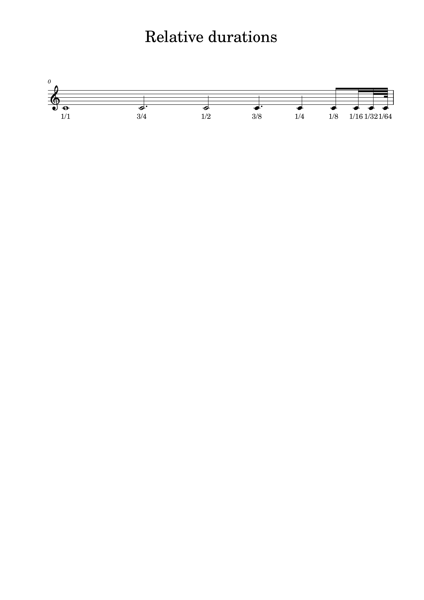

## ABC Elements

The following section shows images, how the translator creates music21 objects 
from abc elements. 
The abc fragments were converted into music21 streams and then used to generate images with musescore.

```
from ABC2M21 import ABCTranslator 
from music21 import converter, environment

abc_tune = """
X:1
T:Twinkle, Twinkle Little Star in C
M:C
K:C
L:1/4
vC C G G|A A G2|F F E E|D D C2|vG G F F|E E D2|
uG G F F|E E D2|vC C G G|A A G2|uF F E E|D D C2|]
"""

a = environment.Environment()
a['musescoreDirectPNGPath'] = '/path/to/musescore'

m21_stream = ABCTranslator(abc_tune)
xmlconv = converter.subConverters.ConverterMusicXML()
xmlconv.write(m21_stream, fmt='musicxml', fp="myfile.png", subformats=['png'])
```


### Pitches über verschiedene Oktaven
```
X:1
T: abc pitches over serval octaves
L:1/8
K:C
C, D, E, F, G, A, B, x | C D E F G A B x | c d e f g a b x | c' d' e' f' g' a' b' x |
w: C, D, E, F, G, A, B, | C D E F G A B | c d e f g a b | c' d' e' f' g' a' b' 
```


### Accidentals
In ABC notation, accidentals are written before the note using symbols such as ^ (sharp), = (natural), and _ (flat). 
Double sharps and flats are denoted by ^^ and __ respectively.
```
X:1
T: accidentals
L:1/8
K:C
^C _D =E ^^F __G
```


### Note duration
```
X:1
T:Relative durations
L:1/4
M:none
K:C
   C4   C3   C2   C3/2  C    C/2  C//   C///  C////
w: 1/1  3/4  1/2  3/8   1/4  1/8  1/16  1/32  1/64 
```
The note duration is relative to the `unit not length`.


### User defined symbols
```
X:1
T:User defined symbols
L:1/4
U:W = !trill!
U:U = !staccato!
U:V = !fermata!
K:C
WC UD VE .F
```


### Decoration_spanner
```
X: 1
T:Decoration spanner
L:1/4
K:C
!<(!ABCD!<)! !>(!ABCD!>)! !trill(!ABCD!trill)!|
```


### Propagate accidentals directive
`I:propagate-accidentals not | octave | pitch`

* When set to 'not,' accidentals are exclusive to the individual notes they are attached to.
* When set to 'octave,' accidentals extend their influence to all notes of the same pitch within 
the same octave, spanning up to the end of the measure. 
* When set to 'pitch,' accidentals extend their influence to all notes of the same pitch 
across all octaves, reaching up to the end of the measure.
* The default value is 'pitch' for ABC version >= 2.0; otherwise, it is 'not'.

Note:
* MuseScore displays accidentals for the first note in all octaves, even if the Display Status is set to 'False'.
```
X:1
T:Propagate-accidentals directive
M:4/4
L:1/4
K:C
[V:1 name="octave"]
[I:propagate-accidentals octave]
   ^C C  D c | C ^C C  c |
w: C# C# D C | C C# C# C |
[V:2 name="pitch"]
[I:propagate-accidentals pitch]
   ^C C  D c   | C ^C C  c  |
w: C# C# D C#  | C C# C# C# |
[V:3 name="not"]
[I:propagate-accidentals not]
   ^C C  D c | C ^C C c |
w: C# C  D C | C C# C C |
```
